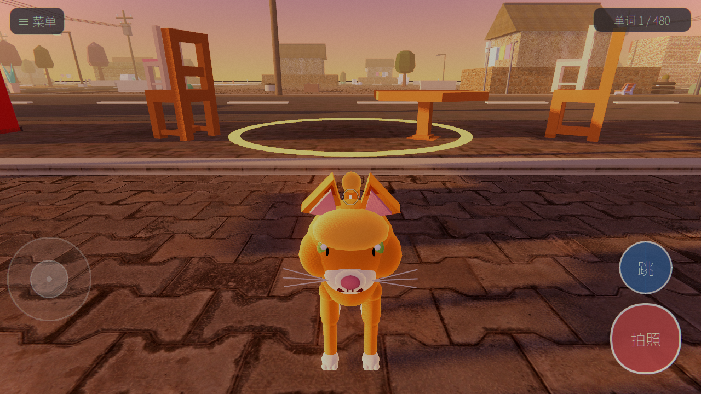
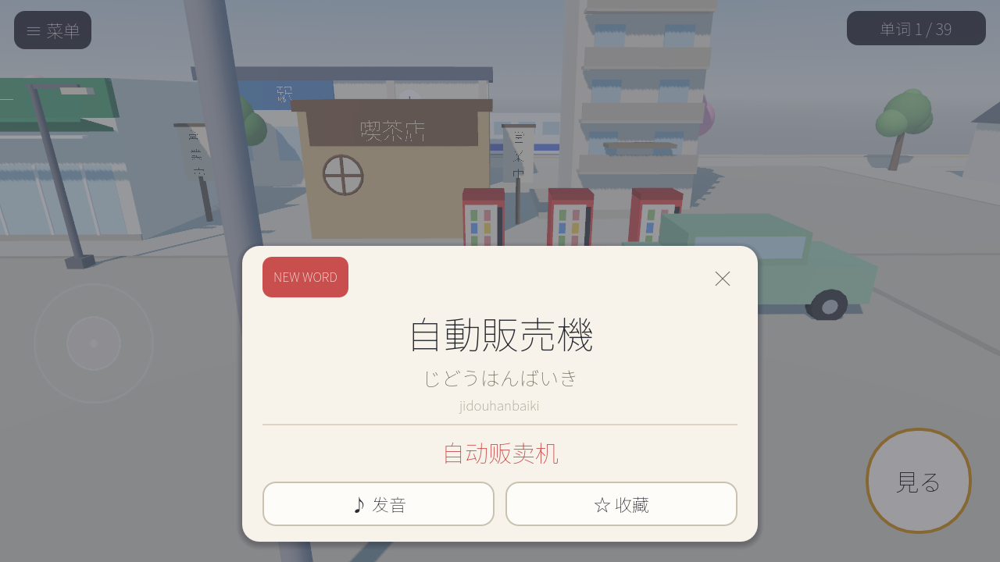
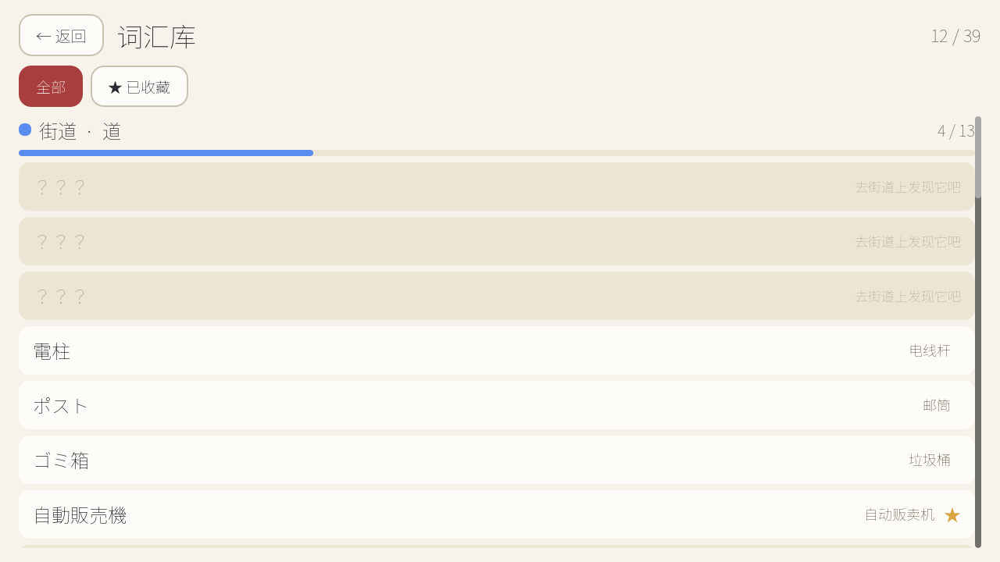
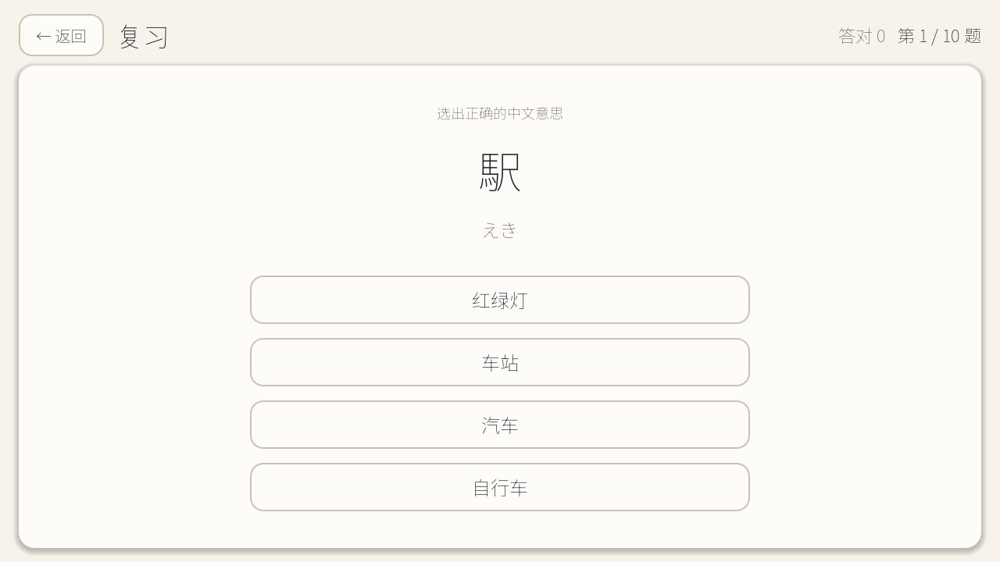

# 日语街道（Nihongo Street）

一个用 **Godot 4** 制作的安卓日语学习游戏，玩法类似 Shashingo：
以**第一人称**漫步在低多边形 3D 日本小镇里（像 Minecraft 手游那样拖动屏幕转视角），
看到什么就点什么——弹出日语单词卡（汉字 / 假名 / 罗马音 / 中文），一键发音，加入你的词汇库。

> 打开手机 → 走进日本小镇 → 随便逛 → 看到东西就点 → 学会它的日语

完全离线：场景、单词、进度、收藏、发音全部保存在本机，无登录、无服务器。

## 游戏截图

| 街景探索（走近物体出现金色光圈） | 拍照弹出单词卡 |
|---|---|
|  |  |

| 词汇库（分类进度 + 收藏） | 复习（10 题选择题） |
|---|---|
|  |  |

---

## 玩法与功能（当前 MVP）

- **3D 街景探索（第一人称）**：130m × 100m 的小镇街区（车站 / 电车 / 商店街 / 公园 / 住宅区 / 家具屋街区）。
  左下虚拟摇杆走路，屏幕任意处拖动转头（桌面端 WASD/方向键 + 鼠标拖动）。
- **拍照学单词（Shashingo 式）**：走近物体后它脚下会出现金色光圈，
  屏幕中央对准它按右下角【拍照】——白闪 + 快门音，弹出单词卡。
  随便点空白处不会触发单词；路面 / 人行道这类"地面单词"要把准星对准地面再拍。
- **48 个可交互物体**（持续扩充中）：自動販売機、電柱、ポスト、ゴミ箱、信号、駅、電車、
  コンビニ、ラーメン屋、家具屋、テーブル、椅子、ベッド、洗濯機、桜、犬、猫……走近后物体脚下出现金色光圈，点击（或按右下角「見る」）学词。
- **单词卡**：日语 / 假名 / 罗马音 / 中文，首次发现显示 NEW WORD 并自动发音。
- **发音**：内置 48 个神经语音合成音频（随游戏打包，离线可用，无需系统 TTS）；桌面端无音频的词条自动回退系统 TTS 朗读假名。
- **词汇库**：按分类查看进度（街道 4/13 这样的进度条），支持收藏筛选、未发现词条提示。
- **复习**：自动出 10 题选择题（看日语选中文 / 看中文选日语交替），
  错词优先复现，为以后接入 SRS 预留了 `review_stats` 数据。
- **本地存档**：已发现单词、收藏、复习记录、玩家位置、设置，自动保存，重开继续。

## 快速开始（电脑上试玩）

1. 安装 [Godot 4.4+](https://godotengine.org/download)（标准版即可，无需 .NET 版）。
2. 打开 Godot → Import → 选择本目录的 `project.godot`。
3. 按 F5 运行。桌面上：WASD/方向键移动，鼠标点击物体。

> 本目录 `_tools/` 里有一份便携版 Godot 4.4.1（`Godot_v4.4.1-stable_win64.exe`），
> 双击即可打开项目，无需安装。

## 导出安卓 APK

1. Godot 编辑器 → Editor → Manage Export Templates → 下载对应版本的导出模板。
2. 安装 Android 开发环境（Android Studio 或仅命令行工具），并在
   Editor → Editor Settings → Export → Android 里配置好 Java SDK / Android SDK。
3. 首次导出前：Project → Install Android Build Template（可选，默认不用 Gradle 也能导出）。
4. Project → Export… → 选择预设 **Android**（本项目已内置 `export_presets.cfg`：
   包名 `com.langcity.nihongostreet`，arm64 + armv7，横屏传感器方向，无需任何权限）
   → Export Project，得到可直接安装的 APK。

- 调试安装：`just installandroid`（或手动 `adb install build/nihongo-street.apk`）
- 手机上首次运行请在系统设置里允许安装未知来源应用。

## 常用命令（justfile）

已内置 [just](https://github.com/casey/just) 任务文件，装好 just 后在项目根目录直接跑：

| 命令 | 作用 |
|---|---|
| `just` / `just --list` | 列出所有可用任务 |
| `just installandroid` | 把 `build/nihongo-street.apk` 安装到已连接的安卓设备（仅安装，不启动） |
| `just download-resource` | 下载外部素材：Poly Haven CC0 贴图（`tools/fetch_textures.py`）+ edge-tts 生成单词发音音频（`tools/gen_audio.py`），增量执行，已有文件自动跳过 |
| `just clean` | 清理 `.godot` 导入缓存和 `out/` 开发截图；**不会**清理 `assets/` 素材与 `build/` APK |

依赖说明：
- `installandroid` 需要手机开启 USB 调试并连接电脑，PATH 里有 `adb`。
- `download-resource` 需要 python3；发音生成依赖 `edge-tts`（`pip install edge-tts`）。
  全部素材已随仓库提交，**克隆后无需执行**，只有新增贴图材质 / 新增单词补音频时才需要重跑。

## 项目结构

```
project.godot            引擎配置（mobile 渲染器、横屏、触控）
justfile                 常用任务（安装 APK / 下载素材 / 清理）
data/
  words.json             ★ 词库：分类 + 单词（ja/kana/romaji/zh/category）
  map.json               ★ 街区地图：物体种类与坐标（像素，1m = 40px）
scenes/                  5 个场景壳（UI 全部由脚本构建）
scripts/
  globals/
    game_state.gd        自动加载 Game：词库、进度、收藏、复习记录、存档、程序生成音效
    tts_manager.gd       自动加载 Tts：系统 TTS 封装（优先日语语音，朗读假名）
    ui_kit.gd            和风 UI 主题（和纸色 + 朱红）、字体加载（内嵌 Noto + 系统字体回退）
    toast.gd             顶部提示条
    shot_tool.gd         开发用自动截图工具（不影响正常游玩）
  street/
    street.gd            街道主场景：环境/HUD/拖动转视角/点击拾取
    interactable.gd      ★ 全部物体的 3D 低多边形模型（几何体拼装 + Label3D 招牌）
    player.gd            玩家（第一人称 + 视角控制 + 头部起伏）
    ground_builder.gd    地面：纹理道路/人行道/井盖/盲道/铁轨站台/公园
    procedural_textures.gd 程序纹理（柏油/砖/瓦/木/草）
    gen_audio 脚本见 tools/
    virtual_joystick.gd  虚拟摇杆
    word_popup.gd        单词卡弹窗
  menus/                 主菜单 / 词汇库 / 复习 / 设置
assets/fonts/            Noto Sans JP/SC 子集（约 1.4MB）
tools/subset_fonts.py    字体子集化脚本
```

## 如何新增单词 / 物体（给未来的批量扩展）

1. **加词条**：在 `data/words.json` 的 `words` 里加一条
   （`id, ja, kana, romaji, zh, category, audio`），category 取现有分类 id 或新增分类。
2. **摆进场景**：在 `data/map.json` 的 `objects` 里加一条
   `{ "word": "你的id", "kind": "已有模型种类", "x": 1200, "y": 900 }`
   —— 坐标是像素（世界 4000×4000，1m = 40px）；同一 `word` 可以摆放多个实例。
3. **加新模型（可选）**：在 `scripts/street/interactable.gd` 里照抄一个 `_b_xxx()`
   构建函数并在 `META` 与 `_build_visual()` 注册，就能用新的外观。
4. **重跑字体子集**（仅当新增了汉字）：`python tools/subset_fonts.py`。
   忘了也没关系，缺字会自动回退到系统字体，只是包体没优化。

建筑附属词（门/窗）用 `"kind": "door"/"window"` 并写 `"host": "建筑kind"`，
会自动贴到该建筑的正面（可用 `dx` 左右偏移）。

## 常见问题

**发音相关的说明**
安卓/iOS 上发音全部使用随游戏打包的音频（`assets/audio/*.mp3`，由 `tools/gen_audio.py`
用微软神经语音 ja-JP-Nanami 生成），不依赖系统 TTS——部分国产 ROM 的 TTS 引擎
会让 Godot 崩溃，因此移动端已彻底绕开。新增单词后可重跑 `tools/gen_audio.py` 补音频；
桌面端缺失音频的词条会用系统 TTS 朗读。

**存档在哪？**
`Android/data` 应用目录下的 `savegame.json`（桌面端在 `%APPDATA%\Godot\app_userdata\日语街道\`）。
游戏内 设置 → 重置全部进度 可清空。

## 后续路线（MVP 之后）

- NPC 简单对话（便利店店员「いらっしゃいませ」+ 选项应答）
- 场景小任务（找到 5 个交通类单词 +XP）
- 更多街区（东京/京都/北海道词汇包）、SRS 复习曲线、真人录音替换 TTS
- 电线杆之间的电线、车辆行人动效、昼夜变化

## 素材来源

- 3D 表面贴图（柏油 / 铺装砖 / 瓷砖外墙 / 灰瓦 / 木板 / 草地 / 混凝土 / 砌块墙）来自
  [Poly Haven](https://polyhaven.com)，**CC0 公共领域**，可自由商用，无需署名（tools/fetch_textures.py 可重新下载）。
- 部分道具模型来自 [Kenney](https://kenney.nl)（Furniture Kit / Food Kit / City Kit 等，**CC0**）
  与 [Poly Pizza](https://poly.pizza)：自行车、麻雀来自 Poly by Google（**CC-BY 4.0**，需署名）；
  燃气罐、消火栓为 CC0。
- 发音音频由微软神经语音 ja-JP-Nanami 合成（tools/gen_audio.py）。

## 技术说明

- Godot 4.4，Mobile 渲染器，MSAA 4x；建筑与街道为运行时几何体拼装，
  道具优先使用外部 CC0/CC-BY 低模（`assets/models/`），包体可控且辨识度更高。
- 单词数据与场景数据完全数据驱动（JSON），UI 与玩法脚本解耦，便于批量扩充。
- 词卡 UI、菜单为和纸配色（#f7f3ea）+ 朱红（#c94f4f）的和风主题。
