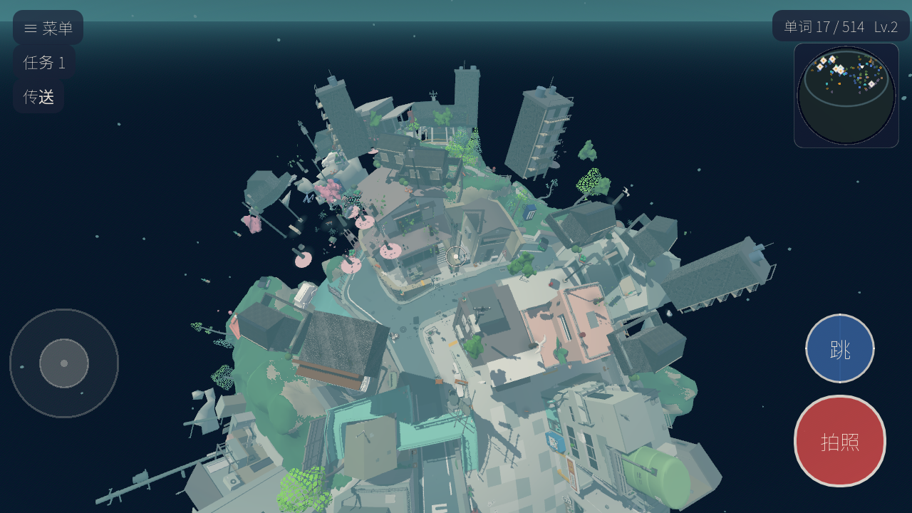
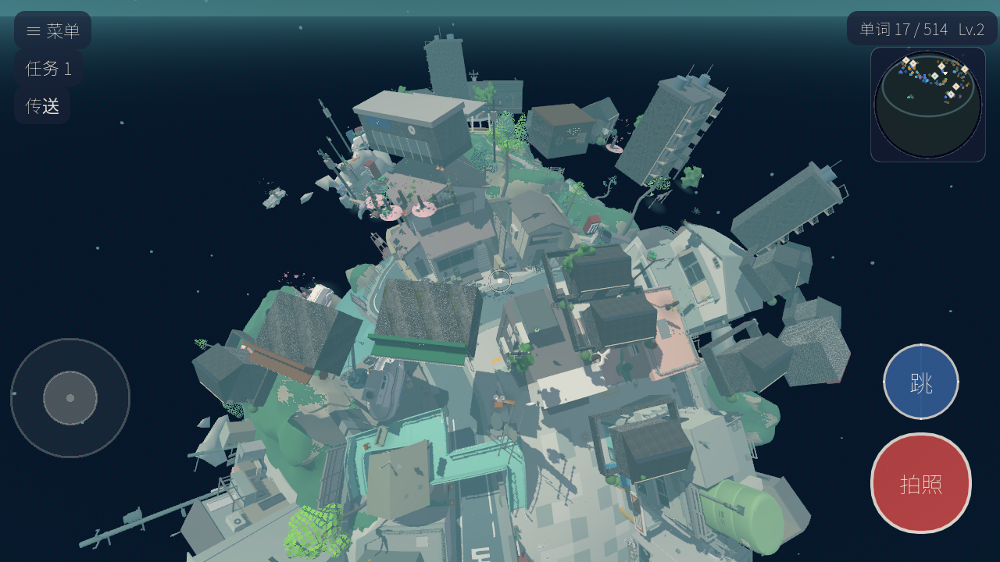
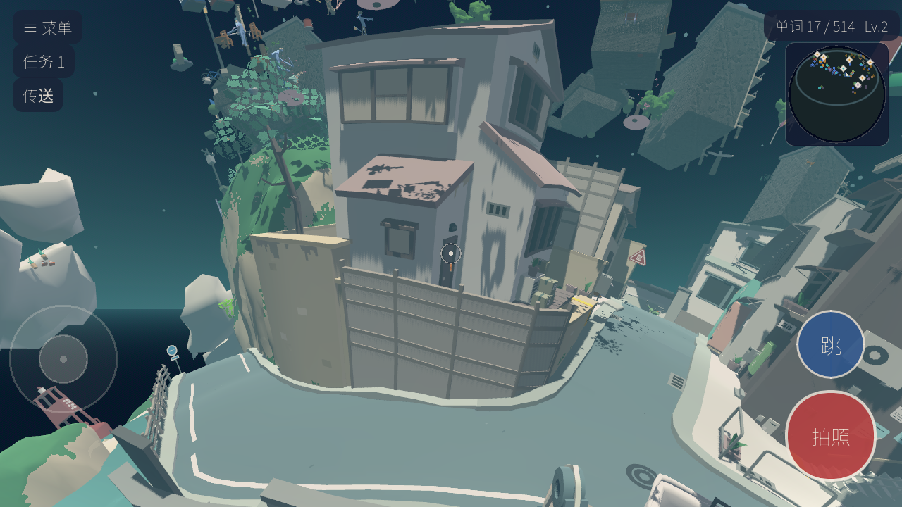
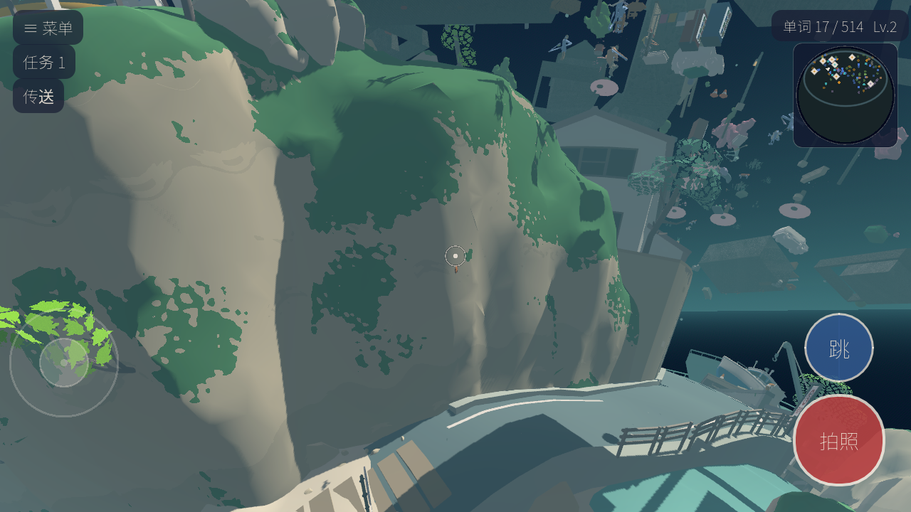

# 星球世界修复记录（碰撞 / 摆放 / 移动）

> 2026-10-05。球状小星球改造上线后用户反馈两个问题：
> ①「怎么那么多东西在天上」②「移动有问题，某些方向阻力特别大」。
> 本文记录根因、修复方案与验证数据，供后续会话查阅。
>
> ⚠️ **注意**：本文第 1.1 节只修了「部分浮空」的成因（碰撞收集 bug + 坐标越界），
> 并**没有**修掉「满岛浮空」——那是另一个独立的时序 bug，2026-10-05 晚些时候才定位。
> 判浮空请看 [MAP_FLOATING_FIX.md](MAP_FLOATING_FIX.md)；本文仍然有效的部分：
> 碰撞三分离（第 2.1 节）、SPEED 乘数回归（第 2.2 节）、curate_planet 整备工具（第 3 节）。

---

## 一、问题现象与根因

### 1. 物件悬空 / 歪斜 / 立在海里

三个来源，前两个是真 bug：

| 来源 | 机理 |
|---|---|
| **碰撞收集 bug** | `planet_builder.gd` 注释写「海/云/树冠/VFX 不挡路」，实现却把树叶、海面、岸沫全塞进 `terrain_root` 做了 trimesh 碰撞。`surface()` 摆放射线（mask 2）从岛外射入，**第一命中是树冠顶/海面** → 物件摆上树梢；玩家（mask 3）也撞上去 → 一圈隐形叶墙 |
| **摆放坐标越界** | planet.json 沿用旧平面城坐标铺满 ±130° 经度（260°），但岛只占球冠中间。图缘物件射线打空走标称球面兜底（= 挂太空）、落在悬崖侧壁（整栋歪斜）、落在**海底地形**（海底也是"地形"，射线全合格但楼立在海里） |
| 原版美术设计 | 岛屿 GLB 自带的边缘悬挑建筑（右下大白楼、码头吊船）是《BEGIN ANYWHERE》diorama 风格，**不是 bug**，别误判。裸岛对照：`--shot-action=demo_bare` |

修复前的全景（注意左下与右侧挂在岛缘外的楼）：



### 2. 「某些方向阻力特别大」

一半是上面的隐形叶墙；另一半是纯回归：

```gdscript
# HEAD（平面版，正确）
var target := want * SPEED          # ← 乘数在这
velocity.x = move_toward(velocity.x, target.x, ...)

# 球面化重构后（回归）
var want := _heading * drive        # 目标速度上限 = drive = 1.0 m/s！
v_tan.x = move_toward(v_tan.x, want.x, ...)   # SPEED=2.35 只剩动画在用
```

**猫实际全程 1.0 m/s**（设计 2.35），上坡更慢 —— 走哪都像陷在泥里，方向差异来自坡度/碰撞叠加。实测修复前巡航 1.0~1.4 m/s，修复后四朝向全部 2.35~2.5。

---

## 二、修复内容

### planet_builder.gd —— 碰撞三分离

| 碰撞体 | 内容 | 层 | 谁在用 |
|---|---|---|---|
| `PlanetBody` | 只有 full_0..9 十块地形 | 1\|2 | 玩家走 + 弹簧臂 + **surface() 射线（mask 2）** |
| `WaterBody` | 水面壳 | 1 | 玩家踩水不沉底、弹簧臂挡镜头；射线与摆件全部无视 |
| `Decor` 根 | 树冠/岸沫/瀑布/云 | 无碰撞 | 纯渲染 |

新增 `water_radius`：水面壳顶点到球心距离的**中位数**（水面是球冠不是全球，AABB 量不准）。海底也是地形、坡度全合格，凡是落人的地方必须先过这道海拔门槛。

### player.gd —— 找回 SPEED 乘数

```gdscript
var want := _heading * (drive * SPEED)   # 球面版正确写法
```

### street.gd —— 摆放/传送加固

- 物件贴坡阈值 `up.dot(dir) > 0.55 → 0.8`（更陡的侧壁宁站不躺，靠整备工具迁走）
- 传送落点候选增加「沿法线高差 < 1.2m」校验（曾把猫放到旁边土丘顶，出生先跳崖）
- 新调试钩子：`demo_bare`（隐藏全部地图物件看裸岛）、`demo_walk:<yaw>`（四向行走测速）

---

## 三、数据整备工具（curate_planet）

`_tools/curate_planet.tscn`：逐物件射线校验落点，坏物件从原位置**螺旋搜索**迁到最近的好地面（保住街区布局），门窗按 host 同 delta 跟随建筑。结果写回 `data/planet.json`（首次自动备份 `.bak`）。

```bash
# 跑到「保留=总数」为止（搬迁互挤需 2~3 轮收敛）
_tools/Godot_v4.4.1-stable_win64_console.exe --path . res://_tools/curate_planet.tscn
# 干跑只看报告
... res://_tools/curate_planet.tscn -- --curate-dry
```

落点合格判定（`_spot_ok`）：

1. 射线命中（岛外/海面 = 落空）
2. **海拔 ≥ water_radius + 0.35m**（海底也合格但楼会立在海里 —— 必查）
3. 坡度 dot ≥ 0.86（大件）/ 0.72（花草道具）
4. **全尺寸 footprint 8 方向**探针，高差 ≤1.5m —— 半径按占地足量（0.7× 时车站被凸丘埋掉半栋的教训）
5. 邻域塌陷探测（四周 2.5m 处明显更低 = 树干顶/崖边探头）
6. 大件互斥：footprint 相切 −1.5m 容差；NPC/出生点只需离墙 0.5m（**猫不许挤走大楼**，否则音 chair 式震荡）

搬迁搜索：步距 1.5m、半径 90m 螺旋；失败放宽互斥到 0.6 再搜；图缘（钳制角）周边无平地时兜底搜**球冠中心**（镇心必有好地面；spawn 在西缘台地，弧距可能超出搜索半径）。

**管线警告：重跑 `make_planet_map.py` 会覆盖整备成果。** 正确顺序：make_planet_map.py → curate_planet.tscn（多轮）。

---

## 四、验证数据

行走测试（`demo_walk:<yaw>`，从出生点全速走 3s，期望 ≈7m）：

| yaw | 修复前 | 修复后 |
|---|---|---|
| 0° | 3.29m（巡速 1.0） | **7.83m（2.35 m/s 恒定）** |
| 90° / 270° | 3.38 / 4.89m | 5.4 / 5.2m（跨沟/坡，正常） |
| 180° | 0.92m | 撞便利店墙（正常游戏行为） |

探针（probe_planet.tscn）：200 物件全命中、无兜底、半径范围 35.0~55.1（下限 = water_radius+0.35，无海底物件）。修复后全景与车站特写：




调试期抓到的中间态（车站被凸丘埋没 + 立在海面），说明为什么 footprint/海拔两条规则不能省：



---

## 五、遗留与注意事项

- 东南图缘两对楼有 ~1.5m 墙角交叠（互斥容差内的收敛残差），低多边 diorama 里不明显，为收敛到此为止；介意可手动微调这两组 px
- 旧存档的 px 位置旁可能正好是搬迁来的楼 —— 出生点防卡保护会沿切向外推（10×1.1m），走两步即恢复
- 岛缘悬挑建筑是原版设计；`demo_bare` 可随时区分「地图物件」和「烘焙几何」
- `_teleport_to_kind` 的 `[tp]` 调试打印只在 `teleport:` 钩子下输出，不影响正常运行
- 用户存档在 `%APPDATA%/Godot/app_userdata/日语街道/savegame.json`，动之前先备份
